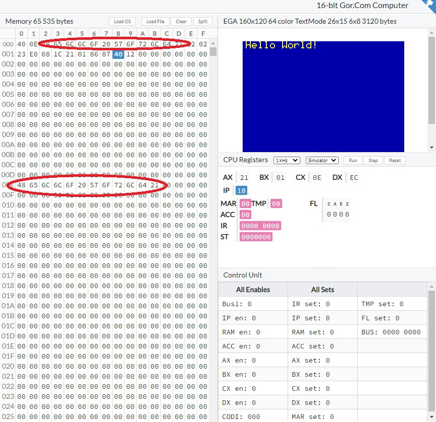

# Виртуальный процессор 8-bit-AON и компилятор

## О проекте

Виртуальный процессор 8-bit-AON — это симулятор компьютера, разработанный с нуля. Название AON означает, что процессор спроектирован из логических вентилей AND, OR, NOT в стиле языков описания аппаратуры HDL.

Посмотреть, как он работает, по ссылке :eyes: [Посмотреть](http://gorcom.online/aon).

Веб-сервер написан на языке C++11. Он по запросу браузера выдает файлы *.html, *.css, *.js.

На сервере работает компилятор (написанный на C++11), который получает от текстового редактора браузера файл с исходным кодом. На сервере происходит компиляция, и обратно браузер возвращается файл с машиным кодом. Симулятор виртуального процессора исполняет машинный код в браузере.

Симулятор написан на языке JavaScript с использованием HTML и CSS для оформления интерфейса, что позволяет легко запустить его в любом веб-браузере как одностраничное приложение (SPA).

## Характеристики компьютера

- **ЦПУ**: 8-битная шина данных, 16-битная шина адреса
- **Регистры**: 4 общих 8-битных регистра
- **Память**: RAM, ROM, VRAM 64KB
- **Графика**: 64-цветный режим, разрешение 160x120 пикселей, текстовый режим 26x15 символов
- **Клавиатура**

2022-2024 Evgeny Goryachev  
Gor.Com

